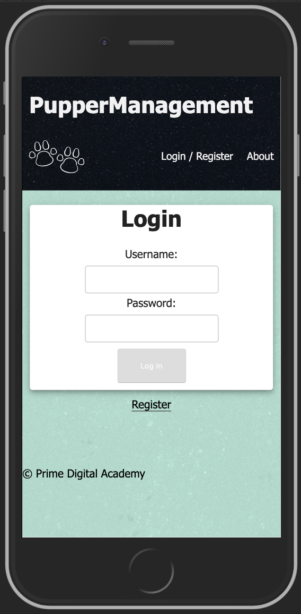
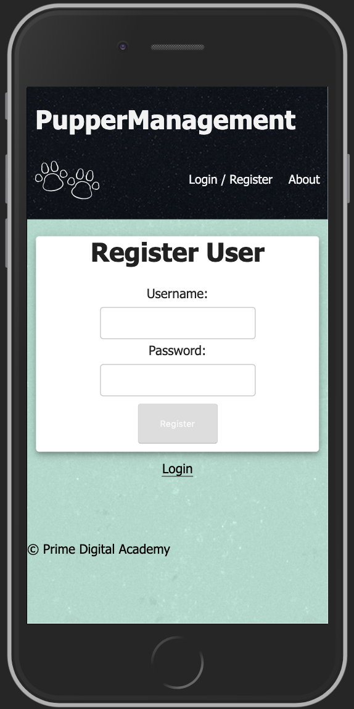
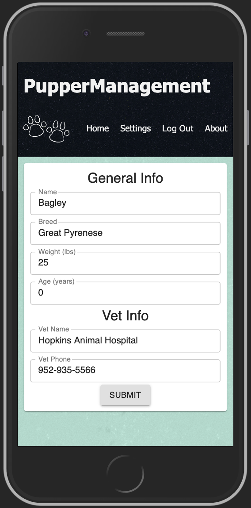

# PupperManagement 

## Application Overview
PupperManagement is a mobile first web application to aid in the management and tracking of responsibilities involved in dog ownership. Features of this app include keeping track of meals, medications, walks, and other outside time. This feature will especially cater to people who share responsibility in taking care of a dog, (ie: couples, roommates, families, etc) and will not only allow “households” to have multiple users, but also allow users to join multiple “households”.

Application Features

1.1 Log-in

Registered users will be able to log in to the application. The Log-in page will contain a link to Create Account page (Registration). 

Forgot password will not be included in this project.

1.2 Registration

Registration contains input fields for username, email, and password. The page has a button in the top left that navigates the user back to the Log-in screen. Below the form is a button to “Create Account” which will finish the process and submit the information.

2.1 New User Homepage

Next, the user will be brought to a new view. Here the user will be prompted to create a new household by clicking the plus sign button in the center of the screen.

3.1 New Household

When creating a new household, users will be prompted to enter a household name of their choosing. They can also add other users to the house. By creating a household, that user will be the admin and will be the only one allowed to add users to the household. 

2.2 Homepage add-pet

When a new user creates an account and new household, they will be brought to a Home Page view. On this page, there are two buttons, one for settings in the top corner that will remain static on every view, and a large button in the center of the screen to add a pet.

3.1 Add a Pet

To add a pet, users are directed to a page with 4 input fields for general info including name of dog, breed, weight, and age. Each of these can be edited later in the settings. The page will also have an option to add a picture of the dog. 

The “next” button below will bring users to the second part of the form to add a dog.

3.2 Add a pet cont., Medical Information.

On the second part of the form, users are prompted to add medical information about the dog. For vet information, users will have to enter vet name and phone number. They will also be prompted to enter any medications the dog may be on, along with frequency and dosing. If a pet is on multiple medications, the user can press Add another medication and another input field will appear below. This can be repeated for every medication.

Once complete, the user will press next.

2.2 Returning User Home Page

The typical Home Page for returning users will include cards for each dog in the household. Each of these cards will include the name, an image (optional), if/when fed, walked, given medications, and when last outside. Each card also has a button (i) to see more information or change information on that dog.

There is also a button below to add a new dog if necessary.

4.1 Pet Info

After a user clicks to get more information on the pet, they are directed to a page with more in depth information (age, weight, breed, vet information, medications, etc). This page also gives users the ability to add “events” including when fed, when walked, given meds, and when they were last taken outside. If any Update button is clicked, it will update the timestamp to the current time/date.

5.1 Settings

There will be 2 different settings views the user can see. If they are on the page of a specific dog, they will be able to edit the information for that pet. If they click settings from the homepage, they will be able to edit their account info, log out, navigate between households and (if an admin) they will be able to add people to the household.

5.1 Add user to Household

When adding another user to a household (admin only), the user will see a view with an input box to enter the username of the user they would like to add. Upon submitting (Add to Household button), that new user will be added to the household. 

5.1 Switch Households

When a user clicks on “Switch Households” from the settings view, they will be brought to a screen with buttons to select from all of the households they are currently a member of.

Project Milestones and Schedule

Milestone (Should match a Feature from Above)
Hours Est.
Due Date
Base or Stretch
Database set up
2 X
Mon 11/18
MVP
User log in
2 X
Mon 11/18
MVP
Basic MUI cards for home page
4 X
Mon 11/18
MVP
Display pet events on home page
4 X
Tues 11/19
MVP
Display pet info on pet info page
3 X
Tues 11/19
MVP
Display pet events on info page
3 X
Tues 11/19
MVP
MUI cards on pet info page
1 X
Tues 11/19
MVP
Ability for user to add pet
6 X
Wed 11/20
MVP
Add settings views
4 X
Thurs 11/21
MVP
Ability for user to switch households
3 X
Thurs 11/21
MVP
Ability for user to create household
4 X
Thurs 11/21
MVP
Ability to add an event for a pet 
2 X
Thurs 11/21
MVP
Display name of household at the top of the homepage 
1 
Fri 11/22
MVP
When user creates household, their selected_household_id will be that new household
2 X
Fri 11/22
MVP
Map through pets medications and displays on pet info page
5 X
Mon 11/25
Base
Add ability for users to see when meds were last given
4 X
Mon 11/25
Base
Add ability for users to input new medications
4 X
Mon 11/25
Base
Ability to edit pet info
5 X
Tues 11/26
Base
Ability to delete medications
3 X
Tues 11/26
Base
Conditionally render add pet button to only show up for admin of that household
2 X
Wed 11/27
Base
Ability to add users to a household
5 X
Wed 11/27
Base
Ability to see all times for an event 
6 
Wed 11/27
Base

Ability for user to add photo of pet
4

Stretch 
Ability to edit times when adding an event 
4 

Stretch
Give users the ability to edit own information

Stretch
Reminders about medications

Stretch
Track vet appointments / when due

Stretch
Email reminders about appts

Stretch
Track any pet allergies

Stretch 
Database Documentation

Browsers

Application will fully support browsers listed below. All browsers or versions not listed below are considered out of scope.

Browser Name
Mobile or Desktop?
Version
Google Chrome
Mobile

Technologies
Node
Express
React
Postgresql
